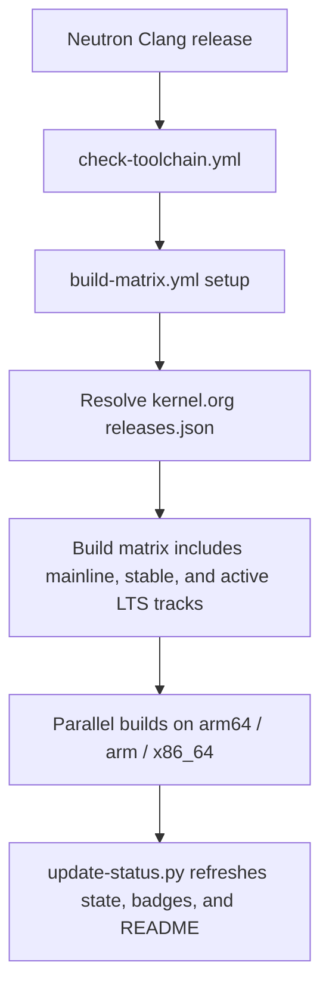

<div align="center">

# Linux Kernel Build Tester

Automated Linux kernel builds for [Neutron Clang](https://github.com/Neutron-Toolchains/clang-build-catalogue).
The build matrix is resolved at runtime from kernel.org, so the repo always tracks the current mainline RC, the current stable release, and every active longterm series.

<p>
  <a href="https://github.com/Neutron-Toolchains/clang-build-catalogue"></a>
  <a href="https://github.com/Neutron-Projects/linux-kernel-build-tester/actions/workflows/build-matrix.yml"></a>
  <a href="https://github.com/Neutron-Projects/linux-kernel-build-tester/actions/workflows/build-matrix.yml"></a>
  <a href="https://github.com/Neutron-Projects/linux-kernel-build-tester/actions/workflows/build-matrix.yml"></a>
  <a href="https://github.com/Neutron-Projects/linux-kernel-build-tester/actions/workflows/build-matrix.yml"></a>
  <a href="https://github.com/Neutron-Projects/linux-kernel-build-tester/actions/workflows/build-matrix.yml"></a>
  <a href="https://github.com/Neutron-Projects/linux-kernel-build-tester/actions/workflows/build-matrix.yml"></a>
  <a href="https://github.com/Neutron-Projects/linux-kernel-build-tester/actions/workflows/build-matrix.yml"></a>
  <a href="https://github.com/Neutron-Projects/linux-kernel-build-tester/actions/workflows/build-matrix.yml"></a>
</p>

---

## Overview

This repository runs a fan-out Linux kernel build matrix across `arm64`, `arm`, and `x86_64` using the current Neutron Clang toolchain.
Kernel versions are resolved from kernel.org at runtime, so the active mainline, stable, and longterm series do not need manual pinning.

<!-- BUILD_TABLE_START -->

> **Neutron Clang:** [`23.0.0git`](https://github.com/Neutron-Toolchains/clang-build-catalogue/releases/tag/03062026)&emsp;**Tag:** `03062026`
> **Last run:** [03 Jun 2026 22:56 UTC](https://github.com/Neutron-Projects/linux-kernel-build-tester/actions/runs/26916608838)

| Kernel | Version | `arm64` | `arm` | `x86_64` |
|:-------|:--------|:-------:|:-----:|:--------:|
| **Mainline** | `7.1-rc6` | [✅ `33m45s`](https://github.com/Neutron-Projects/linux-kernel-build-tester/actions/runs/26916608838) | [✅ `19m04s`](https://github.com/Neutron-Projects/linux-kernel-build-tester/actions/runs/26916608838) | [✅ `8m41s`](https://github.com/Neutron-Projects/linux-kernel-build-tester/actions/runs/26916608838) |
| **Stable** | `7.0.11` | [✅ `34m00s`](https://github.com/Neutron-Projects/linux-kernel-build-tester/actions/runs/26916608838) | [✅ `18m56s`](https://github.com/Neutron-Projects/linux-kernel-build-tester/actions/runs/26916608838) | [✅ `8m37s`](https://github.com/Neutron-Projects/linux-kernel-build-tester/actions/runs/26916608838) |
| **6.18 LTS** | `6.18.34` | [✅ `33m31s`](https://github.com/Neutron-Projects/linux-kernel-build-tester/actions/runs/26916608838) | [✅ `16m32s`](https://github.com/Neutron-Projects/linux-kernel-build-tester/actions/runs/26916608838) | [❌](https://github.com/Neutron-Projects/linux-kernel-build-tester/actions/runs/26916608838) |
| **6.12 LTS** | `6.12.92` | [✅ `27m00s`](https://github.com/Neutron-Projects/linux-kernel-build-tester/actions/runs/26916608838) | [✅ `15m32s`](https://github.com/Neutron-Projects/linux-kernel-build-tester/actions/runs/26916608838) | [✅ `8m31s`](https://github.com/Neutron-Projects/linux-kernel-build-tester/actions/runs/26916608838) |
| **6.6 LTS** | `6.6.142` | [✅ `23m42s`](https://github.com/Neutron-Projects/linux-kernel-build-tester/actions/runs/26916608838) | [✅ `13m27s`](https://github.com/Neutron-Projects/linux-kernel-build-tester/actions/runs/26916608838) | [✅ `7m53s`](https://github.com/Neutron-Projects/linux-kernel-build-tester/actions/runs/26916608838) |
| **6.1 LTS** | `6.1.175` | [✅ `21m02s`](https://github.com/Neutron-Projects/linux-kernel-build-tester/actions/runs/26916608838) | [✅ `15m06s`](https://github.com/Neutron-Projects/linux-kernel-build-tester/actions/runs/26916608838) | [✅ `6m59s`](https://github.com/Neutron-Projects/linux-kernel-build-tester/actions/runs/26916608838) |
| **5.15 LTS** | `5.15.209` | [✅ `16m54s`](https://github.com/Neutron-Projects/linux-kernel-build-tester/actions/runs/26916608838) | [✅ `13m11s`](https://github.com/Neutron-Projects/linux-kernel-build-tester/actions/runs/26916608838) | [✅ `6m01s`](https://github.com/Neutron-Projects/linux-kernel-build-tester/actions/runs/26916608838) |
| **5.10 LTS** | `5.10.258` | [✅ `15m08s`](https://github.com/Neutron-Projects/linux-kernel-build-tester/actions/runs/26916608838) | [✅ `12m18s`](https://github.com/Neutron-Projects/linux-kernel-build-tester/actions/runs/26916608838) | [✅ `6m20s`](https://github.com/Neutron-Projects/linux-kernel-build-tester/actions/runs/26916608838) |

<sub>✅ pass · ❌ fail · ⬜ not run · ⚠N = N compiler warnings · time shown for passing builds</sub>

<!-- BUILD_TABLE_END -->

---

## How It Works



Mainline rows also capture the current upstream HEAD commit so a failed snapshot can be reproduced more easily later.

### Track Resolution

| Track | Source | Notes |
|:------|:-------|:------|
| `mainline` | kernel.org `moniker: mainline` | Current rc snapshot; result.json stores the current HEAD commit |
| `stable` | kernel.org `moniker: stable` | Current stable release |
| `lts-*` | kernel.org `moniker: longterm` | Active longterm series are discovered dynamically |

---

## Triggering a Build

### Automatic

`check-toolchain.yml` polls the [clang-build-catalogue](https://github.com/Neutron-Toolchains/clang-build-catalogue) every 6 hours and dispatches `build-matrix.yml` when a new toolchain tag appears.

### Manual

Use **Actions → 🔨 Build Matrix → Run workflow** and fill in the inputs:

| Input | Description | Default |
|:------|:------------|:--------|
| `toolchain_tag` | Specific Neutron Clang tag, or empty for the latest catalogue entry | latest |
| `clang_version` | Clang version string for display only | — |
| `llvm_commit` | LLVM commit URL for display only | — |
| `kernel_filter` | Limit to one kernel channel, series, or label | `all` |
| `arch_filter` | Limit to one architecture | `all` |
| `triggered_by` | Label used in the commit message | `manual` |

### REST API

```bash
curl -X POST \
  -H "Authorization: Bearer <GITHUB_TOKEN>" \
  -H "Accept: application/vnd.github+json" \
  https://api.github.com/repos/Neutron-Projects/linux-kernel-build-tester/actions/workflows/build-matrix.yml/dispatches \
  -d '{
    "ref": "main",
    "inputs": {
      "toolchain_tag": "22052026",
      "kernel_filter": "all",
      "arch_filter": "all",
      "triggered_by": "api"
    }
  }'
```

To force a catalogue refresh:

```bash
curl -X POST \
  -H "Authorization: Bearer <GITHUB_TOKEN>" \
  -H "Accept: application/vnd.github+json" \
  https://api.github.com/repos/Neutron-Projects/linux-kernel-build-tester/actions/workflows/check-toolchain.yml/dispatches \
  -d '{
    "ref": "main",
    "inputs": {
      "force_build": "true"
    }
  }'
```

---

## Build Metrics

Each build job emits a `result.json` artifact with:

```jsonc
{
  "status": "pass",
  "arch": "arm64",
  "kernel_version": "7.1-rc6",
  "kernel_channel": "mainline",
  "kernel_label": "Mainline",
  "kernel_head_commit": "ba3e43a9e601636f5edb54e259a74f96ca3b8fd8",
  "clang_version": "Neutron Clang 23.0.0git …",
  "toolchain_tag": "22052026",
  "duration_seconds": 342,
  "duration_human": "5m42s",
  "warnings": 4,
  "errors": 0,
  "timestamp_start": "2026-05-22T04:00:01Z",
  "timestamp_end": "2026-05-22T04:05:43Z",
  "run_url": "https://github.com/…/actions/runs/…",
  "exit_code": 0
}
```

Artifacts are retained for 90 days. Failure logs are kept for 14 days.

---

## Badge Integration

```markdown


```

---
·
Kernel versions from
<a href="https://www.kernel.org/releases.json">kernel.org/releases.json</a>
</sub>
</div>
